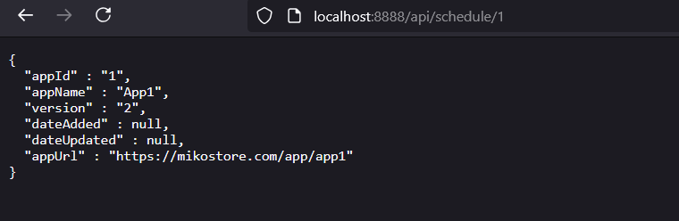
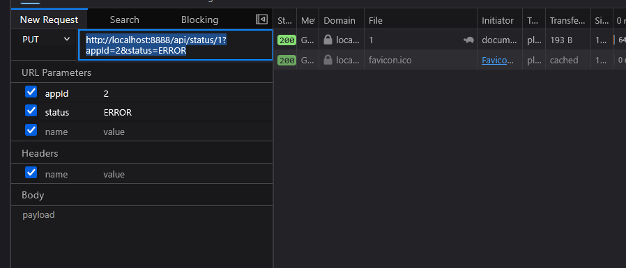
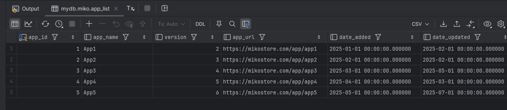
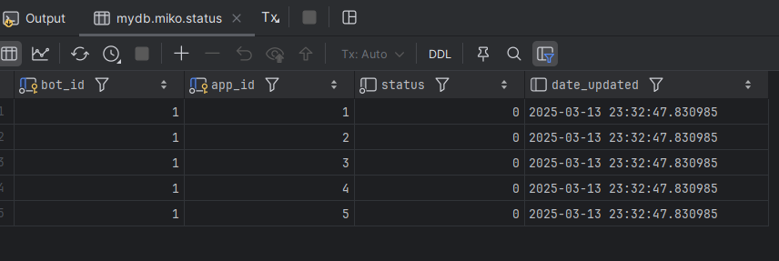
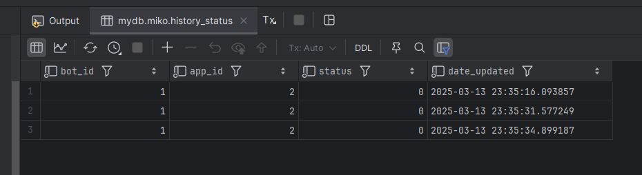
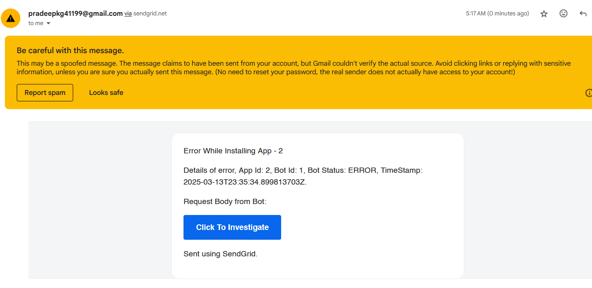

= Mikostore

image:https://img.shields.io/badge/vert.x-4.5.13-purple.svg[link="https://vertx.io"]

This application was generated using http://start.vertx.io

== Building
Built using vert.x, postgres, docker, sendgrid.

To Launch, use :
```
docker compose up
```

Available Endpoints:
```
http://localhost:8888/api/schedule/{botId} -- Integer botId (GET) Sets installable apps to schedule and reruns 1st app to be installed.
http://localhost:8888/api/schedule/{botId}?appId=2 -- Get Next App to Install will return url of 3rd app (GET)
http://localhost:8888/api/status/{botId}?appId=2&status=ERROR -- Update Status of botId and App (PUT), error thrice mail is sent out, automatically inserts into historical table.
```
/schedule endpoint example:



/status endpoint example:



postgres app list table:



postgres status table:



postgres history tracking table:



sample error email:



For sendgrid details reply over shared email.


